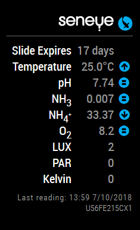
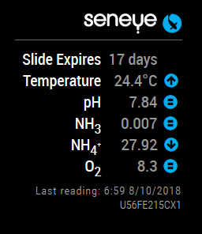
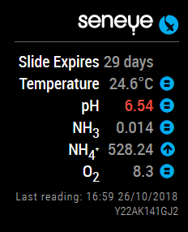
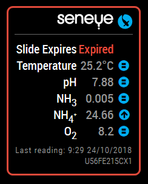
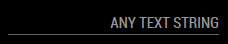
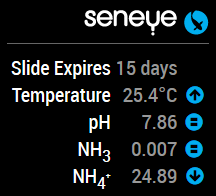
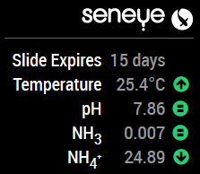
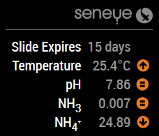

   

# MMM-Seneye
An unofficial <a href="https://www.seneye.com/">Seneye</a> aquarium monitor module for the <a href="https://github.com/MichMich/MagicMirror">MagicMirror</a> project

## Preview
   

## Installation
Clone this respo into your `~/MagicMirror/modules` folder
````javascript
git clone https://github.com/Si-Hill/MMM-Seneye
````

## Using the module
Add `MMM-Seneye` module to the `modules` array in the `config/config.js` file:

###### Minimum config
````javascript
{
	"module": "MMM-Seneye",
	"position": "top_right",
	"config": {
		"deviceID": "12345",
		"email": "example@email.com",
		"password": "password",
	}
}
````

######  All options
````javascript
{
	"module": "MMM-Seneye",
	"position": "top_right",
	"config": {
		"deviceID": "12345",
		"email": "example@email.com",
		"password": "password",
		"temperatureSuffix": "C",
		"logo": "blue",
		"color": "#00aeef",
		"readings": {
			"temperature": true,
			"ph": true,
			"nh3": true,
			"nh4": true,
			"o2": false,
			"lux": false,
			"par": false,
			"kelvin": false
		}
	}
}
````

## Configuration Options
MMM-Seneye uses the official <a href='https://api.seneye.com/'>Seneye API</a>

|Option|Description
|------|-----------
|`deviceID`| **Required**<br />You will need to find out your Seneye Device ID from the Seneye servers.<br /><br />The quickest way is to visit this url in any browser replacing the username and password with your own.  You will get a response that includes your Device ID `https://api.seneye.com/v1/devices?user=***&pwd=***`<br /><br />**Type:** `String`|
|`email`   | **Required**<br />Your email address registered with Seneye.  The same one used to login to <a href='http://seneye.me/'>seneye.me</a><br /><br />**Type:** `String`|
|`password`| **Required**<br />The password associated with the email address above.<br /><br />**Type:** `String`|
|`temperatureSuffix`| **Optional**<br />A text string to display 'C' or 'F' after the temperature reading.<br /><br />**Type:** `String`<br />Default *C*|
|`logo`| **Optional**<br />4 options available, `blue`, `white`, `grey`, or your choice of text<br /><br />   <br /><br />**Type:** `String`<br />Default *blue*|
|`color`| **Optional**<br />Your choice of hex colour code, including the #<br />  <br /><br />**Type:** `String`<br />Default *#00aeef*|
|`readings`| **Optional**<br />An array of readings to display<br /><br />*Optional*<br />Temperature<br />**Type:** `Boolean`<br />Default *true*<br /><br />*Optional*<br />ph<br />**Type:** `Boolean`<br />Default *true*<br /><br />*Optional*<br />nh3<br />**Type:** `Boolean`<br />Default *true*<br /><br />*Optional*<br />nh4<br />**Type:** `Boolean`<br />Default *true*<br /><br />*Optional*<br />o2<br />**Type:** `Boolean`<br />Default *false*<br /><br />*Optional*<br />lux<br />**Type:** `Boolean`<br />Default *false*<br /><br />*Optional*<br />par<br />**Type:** `Boolean`<br />Default *false*<br /><br />*Optional*<br />kelvin<br />**Type:** `Boolean`<br />Default *false*|

## To Do
* Add `node_helper.js`
* <s>Add customisable temperature suffix</s>
* <s>Add some alert functionality</s>
* <s>Add logo/title customisation</s>
* <s>Add custom colour for icons</s>